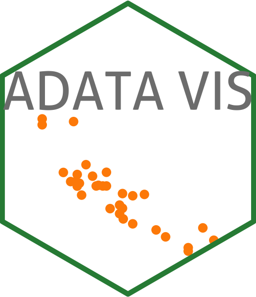

# lwf_ora_vis 

A visualization tool for the ADATA oracle project designed using the R Schiny application.

The application is running on the WSL Shiny server dedicated to LWF: http://shiny14.wsl.ch:3838/apps/lwf_ora_vis/

## Getting started

You need a valid Oracle credentials to work with the visualization. Once logged in, you can select the interested stations, variables, and configurations. Additionally you can adjust other variables you are interested. 

## Run localy

You can also run the application localy. All the packages listed in the `global.R` shall be installed.